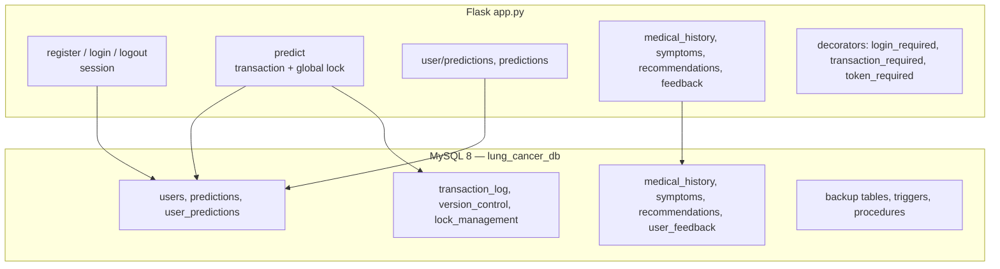

# Lung Cancer Risk Predictor (Flask + MySQL)

**A Flask web app that scores lung-cancer risk from symptoms, built as a database-systems project with transactions, locks, triggers and backups in MySQL.**

     

**LUNG CANCER PREDICTOR** is a Flask 3 web application backed by MySQL 8, built in May 2025 as a database-management-
systems (DBMS) project. Users register and log in, fill a short form (age, gender, smoking, cough, chest pain, fatigue,
shortness of breath) and receive a **risk band — Low, Moderate or High — with a numeric score**. Every prediction is
stored and linked to the user so they can review their history; the schema also covers medical history, a symptom
library, recommendations and feedback.

The project's main teaching focus is the **database layer**: explicit transactions with rollback, a custom
`lock_management` table (an exclusive "one prediction at a time" lock), optimistic `version_control`, a
`transaction_log`, triggers that audit user changes and deleted predictions, stored procedures for backups,
point-in-time recovery, deadlock detection and bulk risk recalculation.

Important: the web app uses a **hand-written scoring rule**, not machine learning. A Random-Forest model script
(`model/dummy_model.py`, trained on the public "survey lung cancer" dataset) exists but is not wired into the app. This
tool is **not a medical device** and must not be used for diagnosis.

## Table of contents

1. [At a glance](#at-a-glance)
2. [Key features](#key-features)
3. [Tech stack](#tech-stack)
4. [Architecture in one picture](#architecture-in-one-picture)
5. [Repository structure](#repository-structure)
6. [Getting started](#getting-started)
7. [Configuration](#configuration)
8. [Available scripts](#available-scripts)
9. [Testing](#testing)
10. [Deployment](#deployment)
11. [Documentation](#documentation)
12. [Project status](#project-status)
13. [Contributing](#contributing)
14. [Security](#security)
15. [Licence](#licence)
16. [Contacts](#contacts)

## At a glance

|  |  |
|---|---|
| What it is | A student web app where a signed-in user answers symptom questions and gets a low / moderate / high lung-cancer risk estimate, with history and medical records stored in MySQL. |
| Who it is for | DBMS course evaluators, students learning Flask + MySQL, and reviewers of the team's portfolio. |
| Status | Academic project (May 2025) — complete for coursework, not for clinical use |
| Primary language | Python + SQL |
| Hosting | Not deployed — runs locally with MySQL |
| Repository | Public — `vansh070605/LUNG-CANCER-PREDICTOR` |
| Default branch | `master` |
| Commits / first / latest | 13 commits · 2025-05-05 → 2025-05-07 |
| Contributors | Vansh Agrawal (12), Hirav Kadikar (1) |
| Upstream | Original repository by Vansh Agrawal (team includes Hirav Kadikar). A fork exists at HiravK/LUNG-CANCER-PREDICTOR. |

## Key features

- **Accounts** — Register (hashed passwords via Werkzeug) and session login; logout
- **Risk assessment** — Rule-based score - age band 1–4, male +2 / female +1, smoking +5, cough +2, chest pain +3, fatigue +1, breathlessness +3 → Low (<6), Moderate (6–9), High (≥10)
- **Prediction history** — `/user/predictions` shows a user's past results; `/predictions` lists all
- **Medical data** — Medical history, symptom library, recommendations and feedback routes | Partly built — four templates are missing
- **Transactions** — `transaction_required` decorator wraps a request in START TRANSACTION / COMMIT / ROLLBACK
- **Concurrency control** — Exclusive row in `lock_management` so only one prediction runs at a time; optimistic `version_control` table
- **Auditing and recovery (SQL)** — Triggers log user changes and deleted predictions; procedures create_backup, point_in_time_recovery, detect_deadlocks, update_all_risk_scores
- **ML experiment** — `model/dummy_model.py` trains a Random Forest and saves model/model.pkl | Not used by the app
- **Project report** — `PROJECT REPORT.docx` and a generator script `generate_document.py`

## Tech stack

| Layer | Technology | Why it is used |
|---|---|---|
| Web | Flask 3.0.2, Jinja2, Flask-CORS | Server-rendered app |
| Security | Werkzeug password hashing, sessions; PyJWT (unused decorator) | Auth |
| Database | MySQL 8 + mysql-connector-python 8.3 | Data, transactions, triggers, procedures |
| ML (experiment) | scikit-learn 1.4 RandomForest, pandas, numpy | Model training script |
| UI | Custom CSS (glassmorphism) | Look and feel |

## Architecture in one picture



Full detail: [docs/ARCHITECTURE.md](docs/ARCHITECTURE.md).

## Repository structure

```text
LUNG-CANCER-PREDICTOR/
├── app.py                    # Flask app
├── config.py                 # unused Config class
├── database/lung_cancer_db.sql
├── model/dummy_model.py, model.pkl
├── templates/                # 9 templates
├── static/styles.css
├── generate_document.py, PROJECT REPORT.docx, Sample Document.docx
├── requirements.txt
└── .venv/                    # Windows virtualenv (should not be committed)
```

## Getting started

### Prerequisites

- Python 3.10–3.12
- MySQL 8 server

### Install and run locally

```bash
git clone https://github.com/HiravK/LUNG-CANCER-PREDICTOR.git
cd LUNG-CANCER-PREDICTOR
python -m venv venv && source venv/bin/activate
pip install -r requirements.txt
mysql -u root -p < database/lung_cancer_db.sql      # creates lung_cancer_db
# edit the MySQL user/password in create_connection() in app.py if not root/root
python app.py                                        # http://127.0.0.1:5000
```

## Configuration

Copy the example file and fill in real values. **Never commit real secrets.**

| Variable | Required | Purpose | Example / default |
|---|---|---|---|
| `SECRET_KEY` | Recommended | Flask session secret (app.py currently hard-codes one) | `long random string` |
| `DB host/user/password` | Yes | Hard-coded in app.py (root/root) — should move to env vars | `localhost / root` |

## Available scripts

| Command | What it does |
|---|---|
| `python app.py` | Run the web app |
| `python model/dummy_model.py` | Train the Random Forest (needs "survey lung cancer.csv") |
| `python generate_document.py` | Generate the project report document |

## Testing

No automated tests. Behaviour was demonstrated manually for the course. See [docs/PROJECT.md](docs/PROJECT.md#quality-and-testing).

## Deployment

Not deployed (academic project). Step-by-step: [docs/RUNBOOK.md](docs/RUNBOOK.md).

## Documentation

Every document below is part of the project's controlled documentation set.

| Document | Audience | What it answers |
|---|---|---|
| [README](README.md) | Everyone | What is it, how do I run it, where is everything? |
| [Project Overview (in depth)](docs/PROJECT.md) | Everyone | Why it exists, every feature explained, timeline, quality, security, risks, glossary |
| [Product Requirements (PRD)](docs/PRD.md) | Product, business, engineering | What problem, for whom, what must it do, how is success measured? |
| [Architecture](docs/ARCHITECTURE.md) | Engineers, architects | How is it built, how does data flow, where does it run, why? |
| [Runbook](docs/RUNBOOK.md) | Engineers, operators | How do I set it up, configure, deploy, roll back and troubleshoot it? |
| [Session Handover](docs/SESSION_HANDOVER.md) | Next owner / next session | Where exactly did work stop and what is next? |

## Project status

A completed DBMS course project (May 2025) by Vansh Agrawal with Hirav Kadikar. The core register → predict → history
flow works locally with MySQL. Medical history, symptoms, recommendations and feedback routes lack templates, the ML
model is not connected, and credentials are hard-coded. The fork (HiravK) is identical to the upstream (vansh070605).

Latest hand-off notes: [docs/SESSION_HANDOVER.md](docs/SESSION_HANDOVER.md).

## Contributing

Branch from the default branch (`feat/…`, `fix/…`), use Conventional Commit messages, open a pull request, and update the docs in the same PR.

## Security

Please do not open public issues for vulnerabilities; contact the maintainer privately. Security design is covered in [docs/PROJECT.md](docs/PROJECT.md#security-and-privacy).

## Licence

No licence file is present, so all rights are reserved by the owner by default. Add a `LICENSE` file before accepting outside contributions or reuse.

## Contacts

| Role | Name | Contact |
|---|---|---|
| Repository owner | Vansh Agrawal | [@vansh070605](https://github.com/vansh070605) |
| Team member | Hirav Kadikar | [@HiravK](https://github.com/HiravK) |
