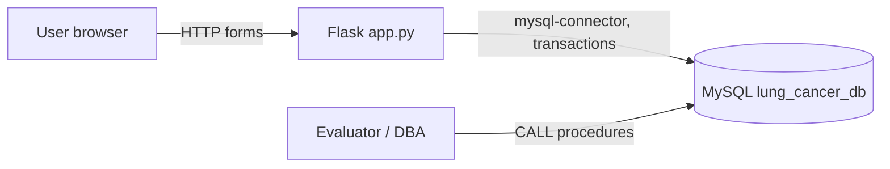
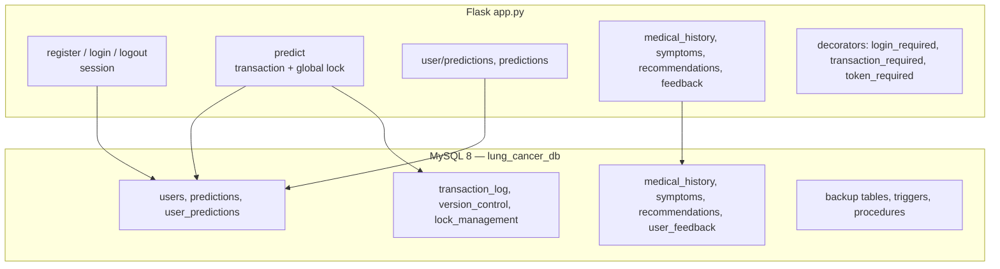
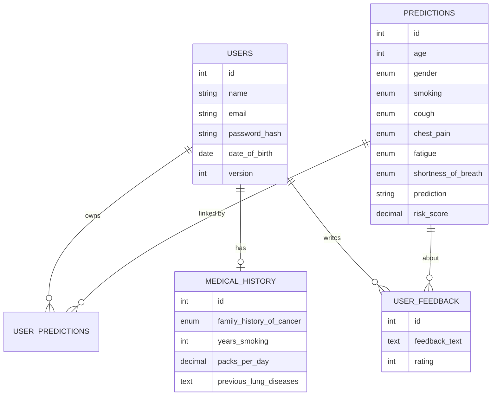

# Architecture Document — Lung Cancer Risk Predictor (Flask + MySQL)

| Field | Value |
|---|---|
| Document ID | LUNGU-ARCH |
| Project | Lung Cancer Risk Predictor (Flask + MySQL) |
| Repository | [`vansh070605/LUNG-CANCER-PREDICTOR`](https://github.com/vansh070605/LUNG-CANCER-PREDICTOR) |
| Version | 1.0 |
| Status | Approved — living document |
| Owner | Hirav Kadikar |
| Classification | Public |
| Last updated | 2026-09-25 |

> **Purpose:** Explains how the system is built: its parts, how data moves, where it runs, and why it was built this way. Structured on the C4 model and arc42.


## 1. Revision history

| Version | Date | Author | Change |
|---|---|---|---|
| 1.0 | 2026-09-25 | Hirav Kadikar | Full documentation suite generated from a complete review of the repository. |


## 2. Introduction and goals

A classic server-rendered Flask app (`app.py`, ~500 lines) with Jinja templates and one stylesheet. Each request that
writes data opens a fresh `mysql.connector` connection with autocommit off; the `transaction_required` decorator starts a
transaction, runs the view, and commits or rolls back. Prediction requests insert a row in `lock_management` (unique on
table + record) to take an exclusive global lock, compute the rule-based score, insert into `predictions` and
`user_predictions`, bump `version_control`, and release the lock. The database script `database/lung_cancer_db.sql`
creates 13 tables plus backup tables, triggers and stored procedures.


### Quality goals (in priority order)

| Priority | Quality attribute | What it means here |
|---|---|---|
| 1 | Data integrity | ACID transactions, versioning, audit logs |
| 2 | Recoverability | Backup tables and point-in-time recovery procedure |
| 3 | Simplicity | One Flask file, server-rendered pages |


## 3. Constraints

- Academic timeline; Windows development (a Windows `.venv` was committed).


## 4. System context (C4 level 1)

Who and what the system talks to.



| External actor / system | Interaction |
|---|---|
| MySQL 8 | All data, triggers, procedures |
| Flask 3, Werkzeug | Web app, password hashing |
| scikit-learn, pandas, numpy | ML experiment |
| PyJWT, Flask-CORS | Token decorator, CORS |


## 5. Containers (C4 level 2)




## 6. Components (C4 level 3)

| Component | Location | Responsibility |
|---|---|---|
| Flask app | `app.py` | Routes, decorators, lock/version helpers, rule-based scoring |
| Config | `config.py` | Config class (secret keys, DB settings) — not imported by app.py |
| Database script | `database/lung_cancer_db.sql` | Tables, triggers, stored procedures, isolation level |
| Templates | `templates/*.html` | base, intro, login, register, dashboard, predict, result, history, index |
| Styles | `static/styles.css` | Glassmorphism dark theme |
| ML experiment | `model/dummy_model.py, model/model.pkl` | Random Forest on "survey lung cancer.csv" |
| Report tooling | `generate_document.py, PROJECT REPORT.docx, Sample Document.docx` | Course report |


## 7. Runtime view — key flows


### Prediction with transaction and global lock

```mermaid
sequenceDiagram
  actor U as User
  participant F as Flask /predict
  participant DB as MySQL
  U->>F: POST symptoms
  F->>DB: START TRANSACTION
  F->>DB: INSERT lock_management (predictions, 0, EXCLUSIVE)
  alt lock row already exists
    F-->>U: "System is busy" (try later)
  else lock acquired
    F->>F: rule-based risk score
    F->>DB: INSERT predictions; INSERT user_predictions
    F->>DB: upsert version_control
    F->>DB: DELETE lock row
    F->>DB: COMMIT
    F-->>U: result page (band + score)
  end
```


## 8. Data architecture

MySQL 8 database `lung_cancer_db` (isolation READ COMMITTED). Core tables: `users`, `predictions`, `user_predictions`,
`medical_history`, `symptoms`, `recommendations`, `user_feedback`. Control tables: `transaction_log`, `version_control`,
`lock_management` (unique table_name + record_id), `deleted_predictions_log`. Backup copies: `users_backup`,
`predictions_backup`, `medical_history_backup`. Triggers: `log_user_changes`, `after_prediction_delete`. Procedures:
`create_backup`, `point_in_time_recovery`, `detect_deadlocks`, `update_all_risk_scores`.




### Entity: users

| Field | Type | Description |
|---|---|---|
| `id, name, email (unique), password_hash` | \| Account |  |
| `date_of_birth, created_at, last_login, version` | \| Profile and optimistic version |  |


### Entity: predictions

| Field | Type | Description |
|---|---|---|
| `age (0–120), gender, smoking, cough, chest_pain, fatigue, shortness_of_breath` | enums/int | Answers |
| `prediction, risk_score` | string, decimal | Result |


### Entity: medical_history

| Field | Type | Description |
|---|---|---|
| `family_history_of_cancer, years_smoking, packs_per_day, previous_lung_diseases, occupational_exposure/details` | \| Background (health data) |  |


### Entity: lock_management

| Field | Type | Description |
|---|---|---|
| `table_name + record_id (unique), lock_type, lock_holder, lock_timeout` | \| Application-level locks |  |


### Entity: version_control / transaction_log

| Field | Type | Description |
|---|---|---|
| `table_name, record_id, version_number, modified_by` | \| Optimistic concurrency and audit |  |


### Interfaces / API endpoints

| Method | Path | Auth | Purpose | Request → Response |
|---|---|---|---|---|
| GET | `/` | Public | Intro, or redirect to dashboard if logged in | — → HTML |
| GET/POST | `/register` | Public | Create account (transaction) | name, email, password → redirect /login |
| GET/POST | `/login` | Public | Session login | email, password → redirect /dashboard |
| GET | `/logout` | Session | Clear session | — → redirect /login |
| GET | `/dashboard` | Session | Home after login | — → HTML |
| GET/POST | `/predict` | Session | Risk form / compute and store | age, gender, smoking, cough, chest_pain, fatigue, shortness_of_breath → result.html |
| GET | `/user/predictions` | Session | Current user's history | — → history.html |
| GET | `/predictions` | Session | All predictions | — → JSON/HTML |
| GET/POST | `/medical_history` | Session | View/save medical history | form fields → medical_history.html (missing) |
| GET | `/symptoms, /recommendations` | Session | Reference lists | — → templates missing |
| GET/POST | `/feedback` | Session | Submit/list feedback | feedback_text, rating → feedback.html (missing) |


## 9. Deployment view

Not deployed (academic project).

| Environment | Where | Notes |
|---|---|---|
| Local | http://127.0.0.1:5000 | MySQL on localhost with root/root |


## 10. Technology stack

| Layer | Technology | Why |
|---|---|---|
| Web | Flask 3.0.2, Jinja2, Flask-CORS | Server-rendered app |
| Security | Werkzeug password hashing, sessions; PyJWT (unused decorator) | Auth |
| Database | MySQL 8 + mysql-connector-python 8.3 | Data, transactions, triggers, procedures |
| ML (experiment) | scikit-learn 1.4 RandomForest, pandas, numpy | Model training script |
| UI | Custom CSS (glassmorphism) | Look and feel |


## 11. Cross-cutting concepts


### Transactions

`transaction_required` gives each writing request its own connection and transaction; any exception rolls back.


### Concurrency

A global exclusive lock row serialises predictions; `version_control` supports optimistic checks (`check_version`).


### Recovery

SQL procedures copy tables to backup tables and restore state to a timestamp.


## 12. Architecture decisions (ADR log)


### ADR-01: Rule-based scoring in the web app

|  |  |
|---|---|
| Status | Accepted |
| Date | 2025-05-05 |
| Context | A transparent score was needed for the demo; the ML model's feature set did not match the short form. |
| Decision | Weighted points by age band, gender, smoking and four symptoms; thresholds 6 and 10. |
| Consequences | Easy to explain; Not clinically validated |
| Alternatives considered | — |


### ADR-02: Application-level global lock for predictions

|  |  |
|---|---|
| Status | Accepted |
| Date | 2025-05-06 |
| Context | Course required demonstrating concurrency control. |
| Decision | Insert a unique row into lock_management before a prediction and delete it after. |
| Consequences | Clear demonstration; Only one user can predict at a time; a crash can leave a stale lock until timeout logic is added |
| Alternatives considered | — |


### ADR-03: MySQL stored procedures for backup and recovery

|  |  |
|---|---|
| Status | Accepted |
| Date | 2025-05-07 |
| Context | Demonstrate recovery concepts inside the DBMS. |
| Decision | create_backup and point_in_time_recovery procedures plus audit triggers. |
| Consequences | Self-contained demo; Not a replacement for real backups (mysqldump/binlog) |
| Alternatives considered | — |


## 13. Quality scenarios

| Scenario | Expected response |
|---|---|
| Two users click Predict at once | Second user sees "System is busy" and retries |
| Database error mid-prediction | Transaction rolls back; no half-saved rows |


## 14. Risks and technical debt

Full register in [PROJECT.md](PROJECT.md#risks-and-technical-debt). Top items:

- **Users treat the score as a diagnosis** — Disclaimer; advise seeing a doctor
- **Health data exposure** — Access control
- **Repo contains binaries and a venv** — Clean up


## 15. Glossary

See [PROJECT.md](PROJECT.md#glossary).
